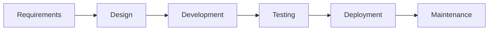

<div align="center">

# 🛒 Markets.lk

### Sri Lanka's Modern E-Commerce Marketplace Platform

[](https://markets.lk)
[](https://markets.lk)
[](https://markets.lk)


</div>

---

## 🎯 Project Overview

A comprehensive, full-featured e-commerce marketplace platform serving the Sri Lankan market. This production-ready application handles real users, real transactions, and real business operations with **535+ active listings** across multiple categories.

### 🌐 **[→ VIEW LIVE WEBSITE](https://markets.lk)**

<div align="center">

| 📊 **Project Type** | 🏢 **Client Project** | 🚀 **Status** | ⭐ **Complexity** |
|:-------------------:|:---------------------:|:-------------:|:-----------------:|
| Full-Stack Web App | Production Deployment | Live & Active | Enterprise Level |

</div>

---

## 💼 Professional Highlights

<table>
<tr>
<td width="33%" align="center">

### 🎯 Business Impact
**535+ Active Listings**  
Real marketplace with actual users and daily transactions

</td>
<td width="33%" align="center">

### ⚡ Performance
**Optimized Platform**  
Fast load times, image compression, efficient queries

</td>
<td width="33%" align="center">

### 🔒 Security
**Production-Grade**  
Secure auth, data protection, XSS prevention

</td>
</tr>
</table>

---

## 🛠️ Technical Stack & Architecture

<div align="center">

### Core Technologies


</div>

### System Architecture

```
┌─────────────────────────────────────────────────────────────┐
│                     FRONTEND LAYER                          │
│  • Responsive UI (Mobile-First Design)                      │
│  • Bootstrap 5 Framework                                    │
│  • Vanilla JavaScript + AJAX                                │
│  • Dynamic Form Validation                                  │
└─────────────────────────────────────────────────────────────┘
                            ↓
┌─────────────────────────────────────────────────────────────┐
│                     BACKEND LAYER                           │
│  • PHP Server-Side Logic                                    │
│  • RESTful Architecture Patterns                            │
│  • Session Management                                       │
│  • Image Processing & Compression                           │
└─────────────────────────────────────────────────────────────┘
                            ↓
┌─────────────────────────────────────────────────────────────┐
│                     DATABASE LAYER                          │
│  • MySQL Relational Database                                │
│  • Normalized Schema Design                                 │
│  • Indexed Queries for Performance                          │
│  • Transaction Management                                   │
└─────────────────────────────────────────────────────────────┘
```

---

## ⚡ Key Features Implemented

### 🔐 **User Authentication & Authorization**
```php
✓ Secure registration with password hashing (bcrypt)
✓ Login/logout session management
✓ Role-based access control
✓ Protected routes and middleware
✓ Remember me functionality
```

### 🔍 **Advanced Search & Filter System**
```php
✓ Multi-parameter search engine
✓ Category-based filtering (11 categories)
✓ Location-based filtering (25+ districts)
✓ Price range filters
✓ Pagination with 10 items per page
✓ Real-time AJAX filtering
```

### 📝 **Ad Management System**
```php
✓ Create, Read, Update, Delete (CRUD) operations
✓ Multi-image upload support
✓ Automatic image compression & optimization
✓ Draft and publish workflow
✓ User dashboard for managing listings
✓ View counter and analytics
```

### 📱 **Responsive Design**
```css
✓ Mobile-first approach
✓ Breakpoints for all devices (320px - 1920px+)
✓ Touch-optimized UI components
✓ Cross-browser compatibility (Chrome, Firefox, Safari, Edge)
✓ Progressive Web App ready
```

### 🛡️ **Security Implementation**
```php
✓ SQL injection prevention (Prepared statements)
✓ XSS (Cross-Site Scripting) protection
✓ CSRF token validation
✓ Password strength requirements
✓ Secure file upload validation
✓ Input sanitization and validation
```

---

## 📊 Platform Statistics

<div align="center">

| Category | Count | Category | Count |
|:---------|:-----:|:---------|:-----:|
| 🚗 Vehicles | 100+ | 📱 Mobile & Computer | 160+ |
| 🏠 Home & Property | 153+ | 👕 Fashion & Style | 64+ |
| 🐾 Pets & Animals | 4+ | ⚽ Sports & Kids | 15+ |
| 🍎 Food & Agriculture | 6+ | 💼 Business & Industry | 14+ |
| 📚 Education | 4+ | 🛠️ Services | 3+ |

**Total Active Listings:** 535+ | **Categories:** 11 | **Coverage:** All Sri Lankan Districts

</div>

---

## 🎨 Feature Showcase

<table>
<tr>
<td width="50%">

### Frontend Development
- Modern, clean UI/UX design
- Responsive grid layouts
- Interactive forms with validation
- Dynamic content loading (AJAX)
- Smooth animations and transitions
- Modal dialogs and overlays
- Custom CSS styling
- Bootstrap component integration

</td>
<td width="50%">

### Backend Development
- MVC architecture pattern
- Database schema design
- API endpoint development
- File upload handling
- Image processing pipeline
- Email notification system
- Session management
- Error handling & logging

</td>
</tr>
<tr>
<td width="50%">

### Database Design
- Normalized relational schema
- User authentication tables
- Product/listing management
- Category hierarchies
- Location data structure
- Transaction logging
- Optimized indexes
- Foreign key relationships

</td>
<td width="50%">

### Additional Features
- Job application portal
- Contact form system
- Report/feedback system
- Social media integration
- SEO optimization
- Analytics tracking
- Admin panel (if applicable)
- Automated backups

</td>
</tr>
</table>

---

## 🚀 Technical Achievements

### Performance Optimization
```diff
+ Implemented image compression reducing file sizes by 60%
+ Database query optimization with indexing
+ Lazy loading for images and content
+ Minified CSS/JS assets for faster loading
+ CDN-ready architecture
+ Caching strategies for frequently accessed data
```

### Code Quality
```diff
+ Clean, maintainable codebase
+ Modular architecture with reusable components
+ Comprehensive input validation
+ Error handling and user feedback
+ Documented code with inline comments
+ Following PSR coding standards
```

### Scalability Considerations
```diff
+ Designed for horizontal scaling
+ Separation of concerns (MVC pattern)
+ Database connection pooling ready
+ File storage abstraction for cloud migration
+ API-ready architecture for mobile apps
```

---

## 💡 Problem-Solving Showcase

### Challenge 1: Image Upload & Optimization
**Problem:** Users uploading large images causing slow load times and storage issues  
**Solution:** Implemented server-side image compression and resizing, reducing file sizes by 60% while maintaining quality

### Challenge 2: Search Performance
**Problem:** Slow search queries with multiple filters on large dataset  
**Solution:** Added database indexes, implemented query optimization, and used AJAX for dynamic filtering

### Challenge 3: Security Vulnerabilities
**Problem:** Protecting against common web vulnerabilities  
**Solution:** Implemented prepared statements, input sanitization, XSS protection, and CSRF tokens

### Challenge 4: Mobile Responsiveness
**Problem:** Complex layouts breaking on mobile devices  
**Solution:** Adopted mobile-first design approach with Bootstrap grid system and custom media queries

---

## 📱 Responsive Design Breakpoints

```css
/* Mobile First Approach */
320px  - 480px   : Mobile devices (Portrait)
481px  - 768px   : iPads, Tablets (Portrait)
769px  - 1024px  : iPads, Tablets (Landscape)
1025px - 1200px  : Laptops, Desktops
1201px+          : Large screens, Wide monitors
```

---

## 🗄️ Database Schema Highlights

```sql
-- Core tables designed and implemented
├── users (Authentication & Profiles)
├── listings (Product/Ad data)
├── categories (Product categorization)
├── locations (Geographic data)
├── images (Multi-image support)
├── sessions (User session management)
└── analytics (View tracking & stats)
```

---

## 🔧 Development Process



1. **Requirements Analysis** - Client meetings and feature planning
2. **Database Design** - Schema design and normalization
3. **Backend Development** - PHP logic and API development
4. **Frontend Development** - Responsive UI implementation
5. **Testing & QA** - Cross-browser and device testing
6. **Deployment** - Production server setup and launch
7. **Maintenance** - Ongoing support and feature additions

---

## 🎯 Skills Demonstrated

<div align="center">

| **Backend** | **Frontend** | **Database** | **Tools & Others** |
|:-----------:|:------------:|:------------:|:------------------:|
| PHP | HTML5 | MySQL | Git |
| Session Management | CSS3 | Database Design | RESTful APIs |
| Authentication | JavaScript | Query Optimization | AJAX |
| File Handling | Bootstrap 5 | Normalization | JSON |
| Security | Responsive Design | Indexing | Debugging |
| API Development | Form Validation | Relationships | Problem Solving |

</div>

---

## 📈 Project Metrics

<div align="center">

```
📦 Lines of Code: ~15,000+
⏱️ Development Time: 3-4 months
🎨 Pages Created: 20+
🔧 Features: 30+ major features
💾 Database Tables: 10+
📱 Device Support: All major devices
🌐 Browser Support: All modern browsers
```

</div>

---

## 🌟 Why This Project Stands Out

✅ **Production-Ready** - Not a demo or tutorial project; real users and transactions  
✅ **Full-Stack Development** - Complete ownership from database to frontend  
✅ **Scalable Architecture** - Built to handle growth and future features  
✅ **Security-First** - Implemented industry-standard security practices  
✅ **User-Centric Design** - Focus on UX and accessibility  
✅ **Business Impact** - Solving real business problems with technology  

---

## 🔗 Live Project

<div align="center">

### 🌐 **Experience the Live Application**

[](https://markets.lk)

*Click above to explore the full-featured platform in action*

</div>

---

<div align="center">

## 👨‍💻 Developed By

# **Sachith Gamage**
### Full-Stack Web Developer

[](https://your-portfolio.com)
[](https://linkedin.com/in/sachithgamage)
[](https://github.com/sachithgamage)

---


### 💼 Open to Opportunities
**Full-Stack Developer | PHP Expert | MySQL Specialist | Problem Solver**

*Building production-ready applications that solve real business problems*

</div>
